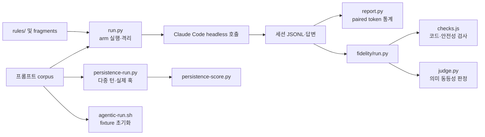

# Benchmarks 구현 보고서

`benchmarks/`는 런타임 기능이 아니었다. 같은 프롬프트에서 기본 응답과 Scrooge 응답을 독립 실행해, **출력 토큰 절감**과 **기술적 내용 보존**의 교환관계를 측정하던 오프라인 도구였다. 이 문서는 삭제된 구현의 핵심만 보존한다.

## 측정 방식

### 1. 통제된 토큰 비교

- 프롬프트 corpus를 `normal`, `terse`, `scrooge:<언어>/<다이얼>` arm에 같은 횟수로 실행했다. `normal`은 기준선, `terse`는 일반적인 간결화 지시 대조군이다.
- 각 arm은 Claude Code의 headless 호출로 **별도 세션**에서 실행됐다. 기본 runner는 규칙을 system prompt로 직접 넣고, 사용자 환경의 기존 훅/규칙이 섞인 행은 제외했다.
- 결과 텍스트 길이가 아니라 세션 JSONL의 실제 `usage.output_tokens`를 읽었다. 도구 호출 토큰과 일반 답변 토큰을 분리했고, headline은 규칙이 실제로 바꿀 수 있는 일반 답변 토큰을 사용했다.
- 같은 `(prompt_id, run)` 쌍만 비교한다. 절감률은 `(baseline - candidate) / baseline`이며, 이상치 영향을 줄이기 위해 중앙값을 사용했다. 반복 실행에는 prompt 단위 bootstrap 신뢰구간과 sign test를 덧붙였다.

### 2. 충실도와 안전성

기준 답변과 압축 답변을 같은 프롬프트 단위로 묶어 세 층으로 평가했다.

1. 결정적 검사: 코드 블록·인라인 코드·URL·경로가 변형되지 않았는지, 보안/파괴적 작업 경고가 누락되거나 반전되지 않았는지 검사한다.
2. 의미 검사: 별도 Claude 호출이 두 답변의 기술적 주장, 단계, 주의사항이 같은지 판정하고 `equivalent`, 누락/변경 주장, `0..1` 보존 점수를 반환한다. 생성 모델과 평가 모델을 분리해 자기평가 편향을 피했다.
3. 반복 판정: 평가자를 여러 번 호출하면 다수결과 중앙 점수를 사용하며, 동률·파싱 실패는 통과가 아니라 보류로 남긴다.

결정적 검사는 오류 탐지에 강하지만 독립 생성된 두 답변의 모든 의미 차이를 판별하지 못한다. 따라서 의미 동등성은 평가자 판정이 headline이고, 코드/안전성 검사는 별도 신호로 보고했다.

### 3. 세션·에이전트 검증

- `persistence`: 하나의 세션을 여러 턴으로 이어 실제 훅 채널에서 규칙이 유지되는지 확인했다. 커밋/PR/outbound 산출물 영역에서 압축 문체가 새지 않는지도 따로 점수화했다.
- `agentic`: arm마다 초기 상태의 작은 코드 fixture를 복원한 뒤 작업을 수행시켰다. 앞선 arm의 파일 변경이 다음 arm의 결과를 오염시키지 않게 하기 위함이다.
- `session evidence`: 실제 사용 세션에서 턴별 일반 답변 길이와 안전/코드 신호의 추세만 관찰했다. 대조군이 없으므로 절감률을 계산하지 않았다.

## 기존 코드 구조

| 모듈 | 역할 |
| --- | --- |
| `run.py` | arm 해석, corpus 반복 실행, 세션 토큰 추출, 오염/오류 행 제외 |
| `report.py` | 동일 prompt/run 쌍의 절감률과 중앙값·신뢰구간 집계 |
| `fidelity/{run,checks,judge,report}.py/js` | 코드/경고 보존 검사와 별도 모델의 의미 동등성 평가 |
| `persistence-{run,score}.py` | 다중 턴에서 규칙 지속성과 경계 문체 누출 측정 |
| `agentic-run.sh`, `agentic-fixture/` | 파일 변경·테스트를 포함한 작업형 비교 |
| `session-evidence/`, `transcript-scan.py` | 실제 세션의 관찰 분석. 절감률 대체 지표가 아님 |

## Codex로 다시 구현한다면

가장 작은 유효 구현은 단일 실행 비교부터다.

1. `prompts.jsonl`에 실제 사용하는 작업 20~50개를 둔다. 각 행은 `id`, `prompt`, `kind`만 가진다.
2. prompt마다 baseline과 candidate를 서로 다른 임시 작업 디렉터리 및 임시 `CODEX_HOME`에서 실행한다. baseline에는 대상 스킬/훅을 두지 않고, candidate에만 둔다. 두 arm은 같은 Codex 모델·권한·작업 복사본을 사용한다.
3. `codex exec --json`으로 이벤트를 JSONL로 저장하고 `--output-last-message`로 최종 답변도 저장한다. 읽기 전용 작업은 `--sandbox read-only`, 코드 작업은 매 arm마다 새 fixture 복사본에서 `workspace-write`를 사용한다.
4. 현재 Codex 세션 로그의 `token_count` 이벤트에서 누적 token usage를 읽는다. 이 저장 형식은 CLI 버전에 따라 바뀔 수 있으므로, runner는 한 번의 샘플을 검증하고 모르는 event schema면 실패해야 한다. `lib/session-log.js`의 `parseCodexSession`이 이미 이 형식의 누적값과 reasoning 토큰 제외 원칙을 구현한다.
5. 결과를 `id`, `arm`, `run`, `model`, `visible_output_tokens`, `final_text`, `error`만 담은 JSONL로 저장한다. 동일 `id/run`끼리만 `(baseline - candidate) / baseline`을 계산하고 중앙값을 출력한다.
6. 품질은 먼저 코드/URL/안전 경고의 결정적 검사만 둔다. 의미 동등성이 필요해질 때만 별도 Codex 평가 호출을 추가하고, `codex exec --output-schema`로 `equivalent`, `missing_claims`, `score` JSON을 강제한다. 평가 실패는 통과가 아니라 보류다.

다중 턴·실제 세션·agentic benchmark는 기본 비교가 유용하다는 것이 확인된 뒤에만 추가한다. Codex CLI는 `--json`, `--output-last-message`, `--output-schema`, sandbox 선택을 제공한다. 실제 이벤트 필드와 세션 저장 형식은 설치된 CLI 버전의 `codex exec --help` 및 한 건의 캡처 결과를 기준으로 고정해야 한다. OpenAI Responses 사용량 객체도 입력·출력 토큰을 제공한다는 점은 [공식 API 참고 문서](https://developers.openai.com/api/reference/cli/resources/responses/methods/retrieve)에서 확인할 수 있다.
